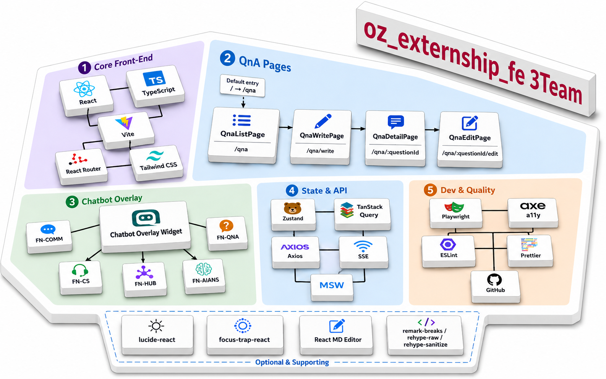

# 오즈코딩스쿨 - 익스턴십 AI 워크플로우

> 오즈코딩스쿨 수강생을 위한 AI 기반 학습 / 질의응답 플랫폼

---

## 📌 프로젝트 소개

오즈코딩스쿨 수강생이 학습 중 마주치는 질문을 동료·튜터와 함께 해결하고,
AI 챗봇의 도움을 받아 빠르게 답을 찾을 수 있도록 설계된 **질의응답(QnA) + AI 챗봇** 통합 플랫폼입니다.

- 질문 등록 → 동료/튜터 답변 → 채택까지의 전 과정을 지원합니다.
- AI 답변/AI 챗봇을 결합해 단순 반복 질문에 대한 응답 속도를 단축합니다.
- 오즈코딩스쿨 메인 서비스(`my.ozcodingschool.site`)와 연동되어 동작합니다.

---

## 🔗 배포 링크

| 구분          | URL                                                                        |
| ------------- | -------------------------------------------------------------------------- |
| 서비스 진입점 | [https://qna.ozcodingschool.site/qna](https://qna.ozcodingschool.site/qna) |
| 메인 도메인   | [https://my.ozcodingschool.site](https://my.ozcodingschool.site)           |

---

## 🎤 프로젝트 발표 영상 & 발표 문서

| 자료      | 링크                       |
| --------- | -------------------------- |
| 발표 영상 | _TBD_ (추후 업데이트 예정) |
| 발표 문서 | _TBD_ (추후 업데이트 예정) |

---

## 🧩 서비스 소개

> 각 기능 시연 영상입니다. GitHub에서는 셀의 ▶︎ 버튼을 눌러 재생할 수 있습니다.

### 🏠 메인 화면

|                                                                    메인 화면 ①                                                                     |                                                                    메인 화면 ②                                                                     |                                                                    메인 화면 ③                                                                     |
| :------------------------------------------------------------------------------------------------------------------------------------------------: | :------------------------------------------------------------------------------------------------------------------------------------------------: | :------------------------------------------------------------------------------------------------------------------------------------------------: |
| <video src="https://github.com/user-attachments/assets/791fe207-6a7f-4e61-8364-00398fc3c301" controls muted loop playsinline width="100%"></video> | <video src="https://github.com/user-attachments/assets/15279ad8-f18a-4b2b-87e1-1f536d3e4762" controls muted loop playsinline width="100%"></video> | <video src="https://github.com/user-attachments/assets/8ecd9a28-2ae6-4448-81c1-640929f3ebd8" controls muted loop playsinline width="100%"></video> |

|                                                                    메인 화면 ④                                                                     |     |     |
| :------------------------------------------------------------------------------------------------------------------------------------------------: | --- | --- |
| <video src="https://github.com/user-attachments/assets/1f35be9c-b68a-465a-88bc-4af292a440f5" controls muted loop playsinline width="100%"></video> |     |     |

### ❓ 질의응답 (QnA)

질문 등록 → 답변 → 채택까지 학습 과정 전체를 지원하며, 마크다운 / 이미지 업로드도 함께 제공합니다.

|                                                                     질문 등록                                                                      |                                                                     질문 수정                                                                      |                                                                     질문 답변                                                                      |
| :------------------------------------------------------------------------------------------------------------------------------------------------: | :------------------------------------------------------------------------------------------------------------------------------------------------: | :------------------------------------------------------------------------------------------------------------------------------------------------: |
| <video src="https://github.com/user-attachments/assets/4802265f-ff06-4d08-ac9a-c8e8a0e72cf6" controls muted loop playsinline width="100%"></video> | <video src="https://github.com/user-attachments/assets/d7e1380d-d9b1-4636-84ee-699f286e3947" controls muted loop playsinline width="100%"></video> | <video src="https://github.com/user-attachments/assets/5c962020-e6f3-4104-9990-ad8c96172c87" controls muted loop playsinline width="100%"></video> |

|                                                                     답변 댓글                                                                      |                                                                     답변 채택                                                                      |                                                                 마크다운 미리보기                                                                  |
| :------------------------------------------------------------------------------------------------------------------------------------------------: | :------------------------------------------------------------------------------------------------------------------------------------------------: | :------------------------------------------------------------------------------------------------------------------------------------------------: |
| <video src="https://github.com/user-attachments/assets/7e2d59b8-c5d1-476b-bc5b-d1f3c6021207" controls muted loop playsinline width="100%"></video> | <video src="https://github.com/user-attachments/assets/74c27a59-270d-4ae1-b52d-392f6e5844cf" controls muted loop playsinline width="100%"></video> | <video src="https://github.com/user-attachments/assets/8981df15-5ac4-4959-9757-8bbc3514b0ff" controls muted loop playsinline width="100%"></video> |

|                                                                   이미지 업로드                                                                    |     |     |
| :------------------------------------------------------------------------------------------------------------------------------------------------: | --- | --- |
| <video src="https://github.com/user-attachments/assets/592826e4-72ea-4840-8b91-93b7f25c2d99" controls muted loop playsinline width="100%"></video> |     |     |

### 🤖 AI 챗봇

QnA 화면 내 보조 챗봇, 오즈코딩스쿨 일반 문의용 CS 챗봇, 그리고 이전 대화를 모아보는 챗봇 허브를 제공합니다.

|                                                                      QnA 챗봇                                                                      |                                                                    CS 챗봇 접속                                                                    |                                                                    CS 챗봇 답변                                                                    |
| :------------------------------------------------------------------------------------------------------------------------------------------------: | :------------------------------------------------------------------------------------------------------------------------------------------------: | :------------------------------------------------------------------------------------------------------------------------------------------------: |
| <video src="https://github.com/user-attachments/assets/4bfa7403-8d6d-4970-ae6e-cfa767082226" controls muted loop playsinline width="100%"></video> | <video src="https://github.com/user-attachments/assets/b9554fac-31bc-407e-b649-5aa53f5e6bef" controls muted loop playsinline width="100%"></video> | <video src="https://github.com/user-attachments/assets/a59e4936-0aaf-40ee-9b17-29e9367a71a0" controls muted loop playsinline width="100%"></video> |

#### 주요 특징

- 질문 등록 / 수정, 답변 등록 / 채택, 답변 댓글까지 지원
- 카테고리(대분류·중분류) 필터, 검색, 정렬
- **AI 답변** 요청 기능 — AI에게 즉시 답변 받기
- **QnA 챗봇 · CS 챗봇 · 챗봇 허브** 3종 — SSE 기반 스트리밍 응답, 플로팅 위젯(FAB)으로 어디서나 호출 가능

---

## 🏗 System Architecture

<p align="center">
  
</p>

> FE3팀이 담당한 클라이언트(React) ↔ API 서버 ↔ AI 챗봇 SSE 스트림까지의 전체 데이터 흐름.

---

## 🛠 사용 스택

### Frontend Core


### State / Data


### Tooling / Quality


### Collaboration


---

## 💻 FE

### 팀원

| 프로필                                                                              | 이름   | 역할      | GitHub                                       |
| ----------------------------------------------------------------------------------- | ------ | --------- | -------------------------------------------- |
|  | 김태환 | 팀장 / FE | [@Yumesa2025](https://github.com/Yumesa2025) |
|    | 박용욱 | 팀원 / FE | [@wook3964](https://github.com/wook3964)     |
|   | 최하늘 | 팀원 / FE | [@choisky13](https://github.com/choisky13)   |

> Organization: [OZ-Coding-School](https://github.com/OZ-Coding-School)

### 기술 스택

| 분류         | 기술                   | 버전    | 비고                                      |
| ------------ | ---------------------- | ------- | ----------------------------------------- |
| Framework    | React                  | 19.2.4  | React Compiler 활성화                     |
| Language     | TypeScript             | 5.9.3   | strict mode                               |
| Build Tool   | Vite                   | 8.0.1   | `@rolldown/plugin-babel` 기반             |
| Styling      | Tailwind CSS           | v4.2.2  | `@theme` 기반 디자인 토큰 (CSS-first)     |
| Routing      | React Router           | 7.13.2  | `AuthLayout` / `DefaultLayout` 분리       |
| Server State | TanStack Query         | 5.95.2  | `queryOptions` 팩토리 패턴 + Suspense     |
| Client State | Zustand                | 5.0.12  | `devtools` 미들웨어                       |
| HTTP Client  | Axios                  | 1.13.6  | JWT 자동 주입 / 401 리프레시 처리         |
| API Mocking  | MSW                    | 2.12.14 | DEV 모드 서비스 워커                      |
| Markdown     | `@uiw/react-md-editor` | 4.1.0   | rehype-sanitize / remark-breaks 함께 사용 |
| Icon         | `lucide-react`         | 1.7.0   |                                           |
| Test (E2E)   | Playwright             | 1.58.2  | 기능 E2E + Visual Regression              |
| Test (a11y)  | `@axe-core/playwright` | 4.11.3  | `pnpm check:a11y`                         |
| Linter       | ESLint                 | 9.39.4  | sonarjs, react-hooks, jsx-a11y 등 포함    |
| Formatter    | Prettier               | 3.8.1   | `prettier-plugin-tailwindcss`             |
| Git Hooks    | Husky + lint-staged    | 9.1.7   | pre-commit / commit-msg / pre-push 3단계  |
| Package Mgr  | pnpm                   | -       | `pnpm-lock.yaml` 사용                     |

---

## 📐 프로젝트 규칙

### 1. Branch Strategy

```
main  ◀─── dev  ◀─── feature/<업무>
                ◀─── fix/<업무>
                ◀─── refactor/<업무>
                ◀─── docs/<업무>
```

- **`main`** — 배포 브랜치. `dev` → `main` PR로만 머지.
- **`dev`** — 통합 브랜치. 모든 작업 브랜치가 머지되는 지점.
- **`<type>/<업무>`** — 개인 작업 브랜치. `dev`에서 분기, `dev`로 PR.

**브랜치 네이밍 예시**

```
feat/login-page
fix/auth-token-expired
refactor/qna-detail-page
docs/add-convention
```

> 자세한 타입 목록: [`docs/convention/CONVENTION.md`](./docs/convention/CONVENTION.md#브랜치-네이밍)

---

### 2. Git Convention

**커밋 메시지 형식**

```
<type>: <설명> (#이슈번호)
```

- 허용 타입: `feat`, `fix`, `refactor`, `style`, `docs`, `test`, `chore`, `build`, `ci`, `perf`
- 이슈 번호는 관련 이슈가 있을 때만 포함
- `commit-msg` 훅에서 형식 자동 검증 (미준수 시 커밋 차단)

**예시**

```
feat: 로그인 기능 추가 (#12)
fix: 토큰 만료 오류 수정 (#15)
refactor: QnA 상세 페이지 컴포넌트 분리
docs: README 작성
```

**Git Hooks (Husky)**

| 훅           | 동작                                                                      |
| ------------ | ------------------------------------------------------------------------- |
| `pre-commit` | `lint-staged` — staged `*.{ts,tsx}`에 ESLint `--fix` + Prettier 자동 적용 |
| `commit-msg` | 커밋 메시지 형식 검증 (`<type>: <설명>`)                                  |
| `pre-push`   | `pnpm build` 실행, 빌드 실패 시 push 차단                                 |

---

### 3. Pull Request

**제목 형식**

```
<type>: <설명> (#이슈번호)
```

**본문 템플릿** ([`.github/PULL_REQUEST_TEMPLATE.md`](./.github/PULL_REQUEST_TEMPLATE.md))

```markdown
## 관련 이슈

- closes #

## 작업 내용

-

## 변경 사항

-

## 스크린샷 (선택)

## 체크리스트

- [ ] 코드가 정상적으로 동작하는지 확인했습니다
- [ ] 불필요한 console.log 또는 디버깅 코드를 제거했습니다
- [ ] 컨벤션에 맞게 작성했습니다
```

**리뷰 정책**

- 최소 1명 이상의 팀원 리뷰 후 머지
- `dev` 브랜치 직접 push 금지, PR로만 반영

---

### 4. Code Convention

| 대상            | 형식                       | 예시             |
| --------------- | -------------------------- | ---------------- |
| 컴포넌트 파일   | PascalCase                 | `LoginForm.tsx`  |
| 컴포넌트 폴더   | PascalCase                 | `LoginForm/`     |
| 페이지 컴포넌트 | PascalCase + `Page` suffix | `LoginPage.tsx`  |
| 훅              | camelCase + `use` prefix   | `useAuth.ts`     |
| 스토어          | camelCase + `Store` suffix | `authStore.ts`   |
| 유틸 / 헬퍼     | camelCase                  | `formatDate.ts`  |
| 상수            | camelCase                  | `routes.ts`      |
| 타입 파일       | camelCase                  | `user.types.ts`  |
| 일반 폴더       | kebab-case                 | `design-tokens/` |

**컴포넌트 디렉토리 구조**

```
src/components/ButtonGroup/
├── ButtonGroup.tsx   # 컴포넌트 본체
└── index.ts          # barrel export
```

> 전체 규칙: [`docs/convention/CONVENTION.md`](./docs/convention/CONVENTION.md)

---

### 5. Communication Rules

- **소통 채널:** Discord에서 수시 소통
- **PR:** 리뷰 후 머지 (직접 push 금지)
- **이슈 트래킹:** GitHub Issues (`Bug Report` / `Feature Request` 두 가지 템플릿)

---

### 6. Documents

| 문서                                                                             | 설명                                    |
| -------------------------------------------------------------------------------- | --------------------------------------- |
| [`docs/convention/CONVENTION.md`](./docs/convention/CONVENTION.md)               | 코딩 컨벤션 (브랜치 · 커밋 · 네이밍)    |
| [`docs/convention/COMPONENTS.md`](./docs/convention/COMPONENTS.md)               | 공통 컴포넌트 컨벤션                    |
| [`docs/convention/ROUTING.md`](./docs/convention/ROUTING.md)                     | 라우트 · 페이지별 API · 컴포넌트명 매핑 |
| [`docs/convention/FEATURES.md`](./docs/convention/FEATURES.md)                   | Feature 모듈 작성 가이드                |
| [`docs/convention/PROJECT_STRUCTURE.md`](./docs/convention/PROJECT_STRUCTURE.md) | 디렉토리 구조 설명                      |
| [`docs/convention/DESIGN_TOKENS.md`](./docs/convention/DESIGN_TOKENS.md)         | Tailwind v4 `@theme` 기반 디자인 토큰   |
| [`docs/convention/STATE_MANAGEMENT.md`](./docs/convention/STATE_MANAGEMENT.md)   | TanStack Query + Zustand 상태관리       |
| [`docs/convention/PAGES.md`](./docs/convention/PAGES.md)                         | 페이지 구현 가이드                      |

---

## 🚀 시작하기

### 요구사항

- Node.js 24 LTS 이상
- pnpm

### 설치 & 실행

```bash
pnpm install      # 의존성 설치
pnpm dev          # 개발 서버 (http://localhost:5173)
pnpm build        # 프로덕션 빌드
pnpm lint         # ESLint
pnpm test:e2e     # Playwright 기능 E2E
pnpm test:visual  # Playwright 비주얼 회귀
```
